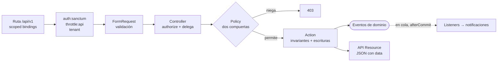
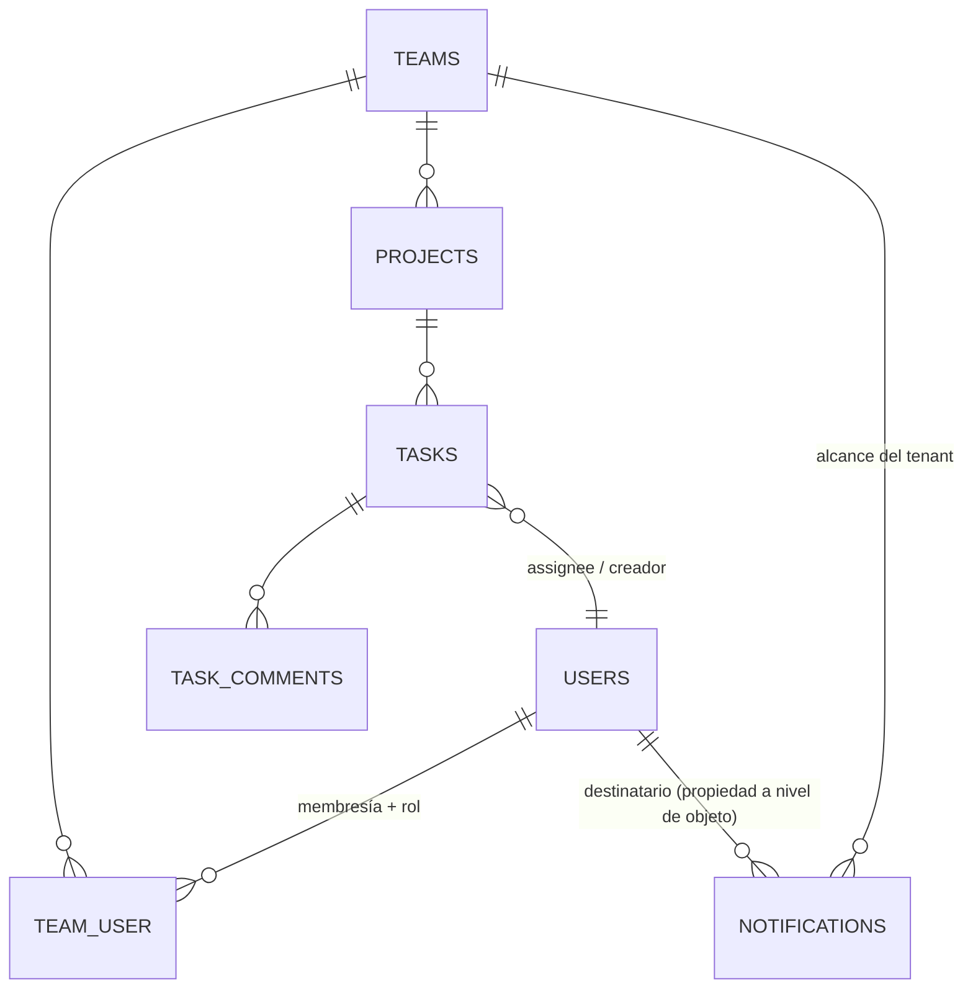
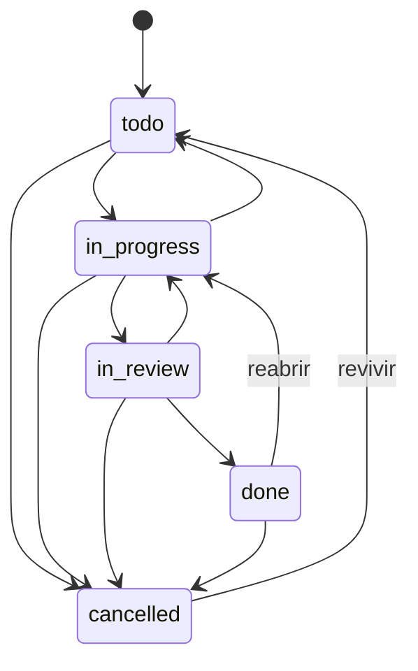

# SaaS Projects API — API REST Laravel grado producción

[](https://github.com/haefrain/laravel-saas-api/actions/workflows/ci.yml)
[](LICENSE)


🇬🇧 [English version](README.md)

Una API REST grado producción y multi-tenant para un SaaS de equipos / proyectos / tareas, construida para mostrar cómo se estructura un código Laravel senior: auth por token (Sanctum), roles y permisos por tenant (spatie), controladores delgados sobre una capa de actions, policies de dos compuertas, una máquina de estados para el ciclo de vida de tareas, eventos de dominio en cola, rate limiting por usuario, un envelope JSON de errores consistente y documentación de API autogenerada — todo bajo análisis estático (Larastan nivel 6), estilo de código (Pint) y una suite Pest de 123 tests, en verde en CI contra MySQL real.

## Stack

- **Laravel 13**, PHP 8.4 — solo API REST (sin UI Blade)
- **Auth:** Laravel Sanctum (tokens de API) · **Roles:** spatie/laravel-permission (modo teams)
- **Base de datos:** MySQL 8 · **Cola/Caché:** Redis
- **Entorno de desarrollo:** Laravel Sail · **Imagen prod:** multi-stage php-fpm + nginx
- **Calidad:** Pest, Larastan (nivel 6), Laravel Pint, Scribe, GitHub Actions

## Arquitectura

Una dirección, una responsabilidad por capa. Los controladores se mantienen delgados: la validación vive en Form Requests, la autorización en policies, las escrituras en actions y la serialización en API resources.



### Modelo de datos



`tasks.team_id` y `task_comments.team_id` se denormalizan **desde la fila padre** dentro de las actions de creación (nunca desde el request ni desde el contexto del tenant), y un test hace join de hijo a padre para probar que la invariante se cumple en cada fila.

### Ciclo de vida de tareas



El grafo vive en el enum respaldado `TaskStatus` y se prueba celda por celda (matriz 5×5). El trabajo no puede saltarse la revisión; los cambios de estado viajan **solo** por `POST .../transition` — `PATCH` prohíbe `status`. Las aristas ilegales devuelven `422 invalid_transition` con las aristas permitidas en `error.details`.

## Multi-tenancy y modelo de seguridad

El tenant es el segmento de ruta `{team}`. El aislamiento se aplica en **tres capas independientes** ([ADR 0003](docs/adr/0003-three-layer-tenant-isolation.md)):

1. **Router** — `scopeBindings()`: los ids anidados se resuelven a través de la relación del padre; un id de otro tenant es 404 antes de que corra cualquier código.
2. **Policies** — cada chequeo re-deriva el equipo **desde el recurso** y responde ambas compuertas: membresía Y permiso con alcance de equipo. El atajo de owner vive dentro de cada método de policy (deliberadamente no en `Gate::before`, que dejaría al owner del equipo A actuar sobre el equipo B). El team-id global de spatie se guarda/restaura alrededor de cada lectura.
3. **Scope de consultas** — un scope global `TeamScope` filtra cada consulta de modelos del tenant al `TeamContext` enlazado; una consulta manual sin where no puede filtrar datos ajenos.

| Capacidad | owner | admin | member |
|---|:--:|:--:|:--:|
| Ver equipo / proyectos / tareas | ✓ | ✓ | ✓ |
| Actualizar equipo · borrar equipo | ✓ · ✓ | ✓ · ✗ | ✗ |
| Crear / actualizar / borrar proyecto | ✓ | ✓ | ✗ |
| Crear / actualizar / asignar / transicionar tarea | ✓ | ✓ | ✓ |
| Borrar tarea / comentario | ✓ | ✓ | solo propios |
| Leer / marcar notificaciones | solo propias | solo propias | solo propias |

La suite insignia codifica el contrato: *al owner del equipo A se le niega cada acción sobre el equipo B*, no hay fuga del team-id de spatie tras ninguna autorización, el IDOR de notificaciones es denegado por policy incluso para owners, y los tres endpoints de listado corren dentro de un presupuesto fijo de queries (guarda contra regresiones N+1).

## Envelope de errores

Cada error de la API comparte una forma legible por máquina, producida centralmente en `bootstrap/app.php`:

```json
{ "message": "Cannot transition from todo to done.",
  "error": { "code": "invalid_transition",
             "details": { "from": "todo", "to": "done",
                          "allowed_transitions": ["in_progress", "cancelled"] } } }
```

`401 unauthenticated` · `403 forbidden | team_forbidden` · `404 not_found` (nunca hace eco del id pedido) · `405 method_not_allowed` · `422 validation_error | invalid_transition` · `429 rate_limited` (+`Retry-After`) · `500 server_error` (mensaje genérico + `trace_id`; internos suprimidos en producción — con test).

Rate limits: el login se llavea por **email+IP** (5/min) además de por IP, así una cuenta no puede sufrir credential-stuffing mientras las demás siguen sin afectarse; el tráfico autenticado es 120/min **por usuario**.

## Arranque rápido

```bash
cp .env.example .env
./vendor/bin/sail up -d        # MySQL 8 + Redis + PHP 8.5
./vendor/bin/sail artisan key:generate
./vendor/bin/sail artisan migrate
./vendor/bin/sail test         # Pest
```

La API se sirve en `http://localhost:8081`.

### Referencia de la API

```bash
./vendor/bin/sail artisan scribe:generate
```

Docs interactivas en `http://localhost:8081/docs` (más una colección Postman y un spec OpenAPI 3 bajo `storage/app/private/scribe/`).

## Imagen de producción

`Dockerfile` multi-stage: una etapa composer instala vendors `--no-dev` optimizados; la etapa de runtime es `php:8.4-fpm-alpine` con opcache (+JIT, timestamps off), redis/pdo_mysql/pcntl, corriendo como `www-data`. Las cachés del framework (`config|route|event:cache`) las construye el entrypoint al arrancar el contenedor — dependen del env, así que no se hornean en la imagen. Sin `.env`, tests ni tooling de desarrollo dentro (~190 MB).

```bash
cp .env.production.example .env.production   # define APP_KEY, DB_PASSWORD…
docker compose -f compose.prod.yaml up -d --build
```

Topología: nginx → app php-fpm + un worker dedicado `queue:work redis` para los listeners en cola, MySQL 8, Redis, healthchecks en `/up`.

## Testing

```bash
./vendor/bin/sail test                                # 123 tests / 359 aserciones
./vendor/bin/sail php vendor/bin/phpstan analyse      # Larastan nivel 6, 0 errores
./vendor/bin/sail php vendor/bin/pint --test          # estilo de código
```

Lo que las suites protegen de verdad: aislamiento cross-tenant por recurso y verbo (404 anidado / 403 policy), ubicación del owner-bypass, regresión de fuga de estado global de spatie, la matriz completa de transiciones, spoofs de mass-assignment (`team_id`, `created_by`, `user_id` se derivan en el servidor), IDOR de notificaciones, efectos de listeners en cola (driver sync: se afirman filas reales), throttling de login por email y supresión de 500 en producción. CI corre Pint + Larastan + Pest contra un service container de MySQL real.

## Decisiones de diseño (ADRs)

| Decisión | Registro |
|---|---|
| Tenancy por el segmento de ruta `/teams/{team}` | [ADR 0001](docs/adr/0001-route-segment-tenancy.md) |
| Modo teams de spatie + dual-write de `membership_role` | [ADR 0002](docs/adr/0002-spatie-teams-dual-write.md) |
| Aislamiento de tenant en tres capas, `team_id` denormalizado | [ADR 0003](docs/adr/0003-three-layer-tenant-isolation.md) |
| Tabla de notificaciones custom con alcance de tenant | [ADR 0004](docs/adr/0004-custom-notifications-table.md) |
| Máquina de estados en enum + excepciones de dominio | [ADR 0005](docs/adr/0005-enum-state-machine-domain-exceptions.md) |

## Fuera de alcance (deliberadamente)

Endpoints de invitaciones y gestión de roles de miembros (las invariantes de último-owner y de acuñado de roles están diseñadas en los ADRs pero aún no expuestas), granularidad de abilities en tokens, canales de email para notificaciones, sharding horizontal. Son roadmap, no accidentes.

## Hitos

- [x] **L1** — Scaffold, Sail, tooling (Pint, Larastan, Pest), CI
- [x] **L2** — Autenticación Sanctum + usuarios
- [x] **L3** — Teams, multi-tenancy y roles/permisos spatie
- [x] **L4** — Proyectos (CRUD, policies, resources, requests)
- [x] **L5** — Tareas, asignación y estados, eventos en cola
- [x] **L6** — Versionado de API, rate limiting, manejo de errores, docs Scribe
- [x] **L7** — Imagen Docker de producción, docs de arquitectura y ADRs

## Licencia

[MIT](LICENSE) © Efraín Hernández
