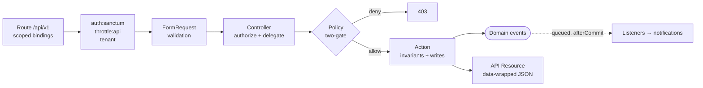
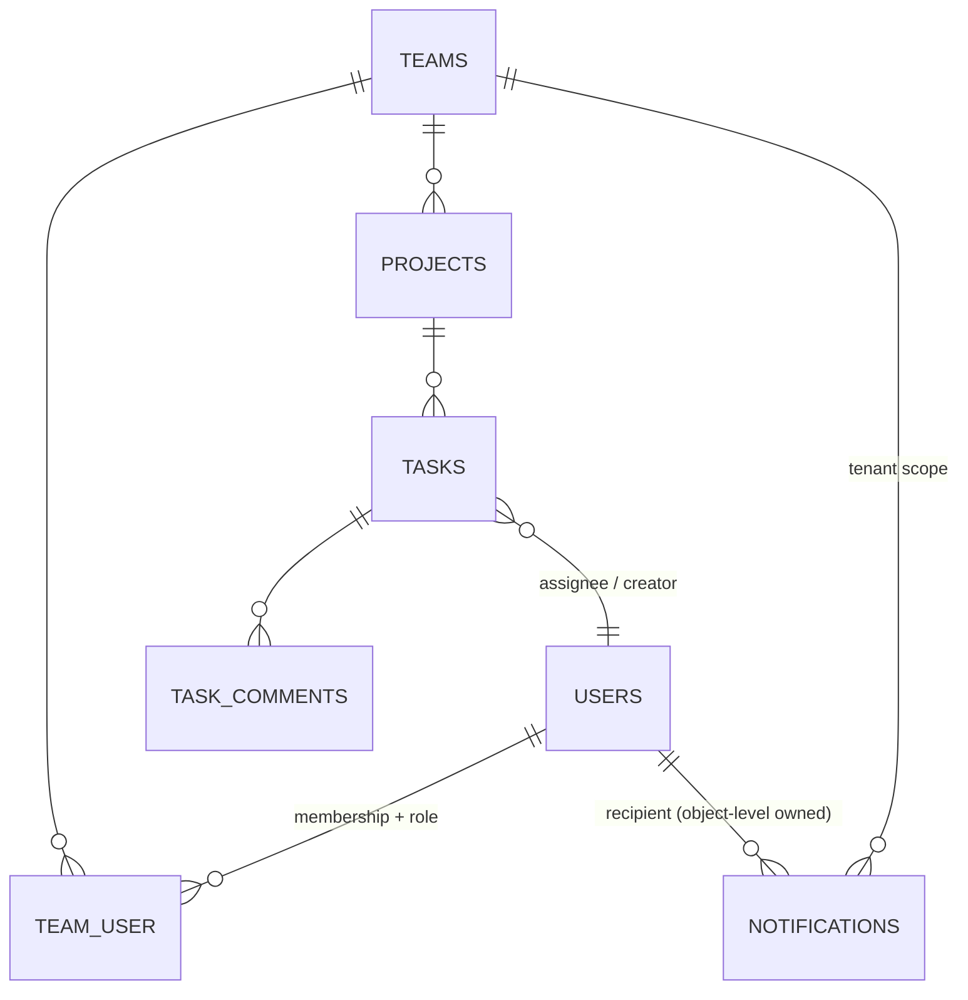
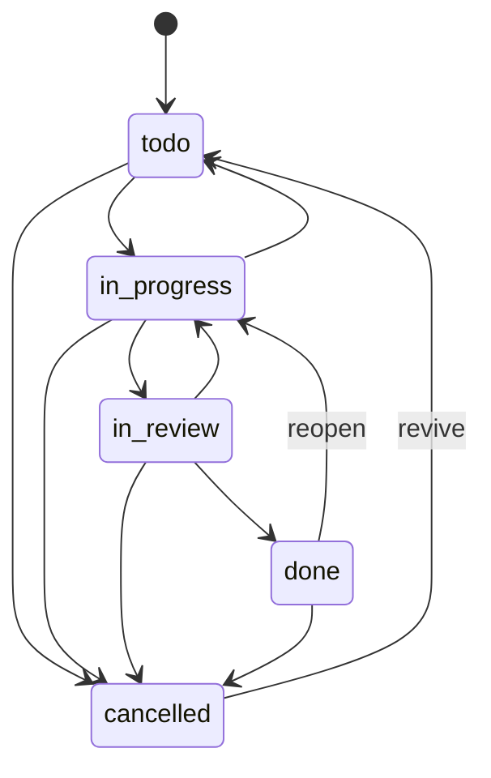

# SaaS Projects API — Production-grade Laravel REST API

[](https://github.com/haefrain/laravel-saas-api/actions/workflows/ci.yml)
[](LICENSE)


🇪🇸 [Versión en español](README.es.md)

A production-grade, multi-tenant REST API for a team / projects / tasks SaaS, built to show how a senior Laravel codebase is structured: token auth (Sanctum), team-scoped roles & permissions (spatie), thin controllers over an action layer, two-gate policies, a task lifecycle state machine, queued domain events, per-user rate limiting, a consistent JSON error envelope and auto-generated API docs — all under static analysis (Larastan level 6), code style (Pint) and a 123-test Pest suite, green in CI against real MySQL.

## Stack

- **Laravel 13**, PHP 8.4 — REST API only (no Blade UI)
- **Auth:** Laravel Sanctum (API tokens) · **Roles:** spatie/laravel-permission (teams mode)
- **Database:** MySQL 8 · **Queue/Cache:** Redis
- **Dev environment:** Laravel Sail · **Prod image:** multi-stage php-fpm + nginx
- **Quality:** Pest, Larastan (level 6), Laravel Pint, Scribe, GitHub Actions

## Architecture

One direction, one job per layer. Controllers stay thin: validation lives in Form Requests, authorization in policies, writes in actions, serialization in API resources.



### Data model



`tasks.team_id` and `task_comments.team_id` are denormalized **from the parent row** inside the create actions (never from the request or the tenant context), and a test joins child to parent to prove the invariant holds for every row.

### Task lifecycle



The graph lives in the `TaskStatus` backed enum and is unit-tested cell by cell (5×5 matrix). Work cannot skip review; status changes travel **only** through `POST .../transition` — `PATCH` prohibits `status`. Illegal edges return `422 invalid_transition` with the allowed edges in `error.details`.

## Multi-tenancy & security model

The tenant is the `{team}` route segment. Isolation is enforced by **three independent layers** ([ADR 0003](docs/adr/0003-three-layer-tenant-isolation.md)):

1. **Router** — `scopeBindings()`: nested ids resolve through the parent relation; a cross-tenant id is a 404 before any code runs.
2. **Policies** — every check re-derives the team **from the resource** and answers both gates: membership AND team-scoped permission. The owner short-circuit lives inside each policy method (deliberately not `Gate::before`, which would let the owner of team A act on team B). spatie's process-global team id is saved/restored around every read.
3. **Query scope** — a global `TeamScope` filters every tenant-model query to the bound `TeamContext`; a hand-written where-less query cannot leak.

| Ability | owner | admin | member |
|---|:--:|:--:|:--:|
| View team / projects / tasks | ✓ | ✓ | ✓ |
| Update team · delete team | ✓ · ✓ | ✓ · ✗ | ✗ |
| Create / update / delete project | ✓ | ✓ | ✗ |
| Create / update / assign / transition task | ✓ | ✓ | ✓ |
| Delete task / comment | ✓ | ✓ | own only |
| Read / mark notifications | own only | own only | own only |

The headline suite encodes the contract: *the owner of team A is denied every action on team B*, no spatie team-id leak after any authorization, notification IDOR is policy-denied even for owners, and the three list endpoints run within a fixed query budget (N+1 regression guard).

## Error envelope

Every API error shares one machine-readable shape, produced centrally in `bootstrap/app.php`:

```json
{ "message": "Cannot transition from todo to done.",
  "error": { "code": "invalid_transition",
             "details": { "from": "todo", "to": "done",
                          "allowed_transitions": ["in_progress", "cancelled"] } } }
```

`401 unauthenticated` · `403 forbidden | team_forbidden` · `404 not_found` (never echoes the requested id) · `405 method_not_allowed` · `422 validation_error | invalid_transition` · `429 rate_limited` (+`Retry-After`) · `500 server_error` (generic message + `trace_id`; internals suppressed in production — tested).

Rate limits: login is keyed per **email+IP** (5/min) on top of per-IP, so one account cannot be credential-stuffed while others stay unaffected; authenticated traffic is 120/min **per user**.

## Quick start

```bash
cp .env.example .env
./vendor/bin/sail up -d        # MySQL 8 + Redis + PHP 8.5
./vendor/bin/sail artisan key:generate
./vendor/bin/sail artisan migrate
./vendor/bin/sail test         # Pest
```

The API is served at `http://localhost:8081`.

### API reference

```bash
./vendor/bin/sail artisan scribe:generate
```

Interactive docs at `http://localhost:8081/docs` (plus a Postman collection and an OpenAPI 3 spec under `storage/app/private/scribe/`).

## Production image

Multi-stage `Dockerfile`: a composer stage installs `--no-dev` optimized vendors; the runtime stage is `php:8.4-fpm-alpine` with opcache (+JIT, timestamps off), redis/pdo_mysql/pcntl, running as `www-data`. Framework caches (`config|route|event:cache`) are built by the entrypoint at container start — they depend on env, so they are not baked into the image. No `.env`, tests or dev tooling inside (~190 MB).

```bash
cp .env.production.example .env.production   # set APP_KEY, DB_PASSWORD…
docker compose -f compose.prod.yaml up -d --build
```

Topology: nginx → php-fpm app + a dedicated `queue:work redis` worker for the queued listeners, MySQL 8, Redis, healthchecks on `/up`.

## Testing

```bash
./vendor/bin/sail test                                # 123 tests / 359 assertions
./vendor/bin/sail php vendor/bin/phpstan analyse      # Larastan level 6, 0 errors
./vendor/bin/sail php vendor/bin/pint --test          # code style
```

What the suites actually protect: cross-tenant isolation per resource and verb (404 nested / 403 policy), owner-bypass placement, spatie global-state leak regression, the full transition matrix, mass-assignment spoofs (`team_id`, `created_by`, `user_id` are server-derived), notification IDOR, queued listener side-effects (sync driver: real rows asserted), login email-throttling and production 500 suppression. CI runs Pint + Larastan + Pest against a real MySQL service container.

## Design decisions (ADRs)

| Decision | Record |
|---|---|
| Tenancy via the `/teams/{team}` route segment | [ADR 0001](docs/adr/0001-route-segment-tenancy.md) |
| spatie teams mode + `membership_role` dual-write | [ADR 0002](docs/adr/0002-spatie-teams-dual-write.md) |
| Three-layer tenant isolation, denormalized `team_id` | [ADR 0003](docs/adr/0003-three-layer-tenant-isolation.md) |
| Custom tenant-scoped notifications table | [ADR 0004](docs/adr/0004-custom-notifications-table.md) |
| Enum state machine + domain exceptions | [ADR 0005](docs/adr/0005-enum-state-machine-domain-exceptions.md) |

## Out of scope (deliberately)

Member invitation / role-management endpoints (the last-owner and role-minting invariants are designed in the ADRs but not exposed yet), token abilities granularity, email channels for notifications, horizontal sharding. They are roadmap, not accidents.

## Milestones

- [x] **L1** — Scaffold, Sail, tooling (Pint, Larastan, Pest), CI
- [x] **L2** — Sanctum authentication + users
- [x] **L3** — Teams, multi-tenancy & spatie roles/permissions
- [x] **L4** — Projects (CRUD, policies, resources, requests)
- [x] **L5** — Tasks, assignment & status, queued events
- [x] **L6** — API versioning, rate limiting, error handling, Scribe docs
- [x] **L7** — Production Docker image, architecture docs & ADRs

## License

[MIT](LICENSE) © Efraín Hernández
